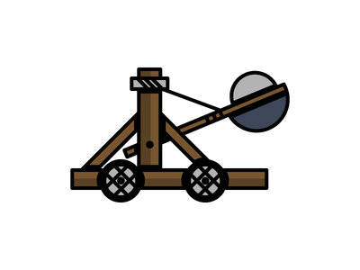

# 
Create a distributed, fault tolerant **application as a service** by implementing **3 callback functions**. Catapult is a mesos framework SDK that abstracts the scheduler and executor interfaces, and handles persistent storage for application state. Catapult allows the developer to define with what level of detail they want to control their application.

# Prerequisites
- java
- maven

# Install
Catapult is not currently hosted as a maven artifact so you'll need to download the source and built it manually :(. During the install phase of the build the jar file will be installed into your local maven repo.
```
git clone https://github.com/timbouvier/catapult.git
cd catapult
make install
```

# Usage
There are three main pieces to an application
  - SchedulerNode
    - A java object you will extend to implement any node level logic and event processing
  - SchedulerApp
    - A java object you will extend to implement any app level logic and event processing
  - MesosAppListener
    - A java object you will extend to implement any framework level logic and event processing

#### Create Scheduler Node Listener
```java
public class MyNode extends SchedulerNode {

   @Override
   public void failed(AppDriver appDriver){
      /*default implementation will relaunch node*/
   }
   
   @Override
   public void running(AppDriver appDriver){
     /*default implementation does nothing*/
   }
   
   @Override
   public void finished(AppDriver appDriver){
    /*default implementation does nothing*/
   }
   
   @Override
   public void killed(AppDriver appDriver){
     /*default implementation relaunches node*/
   }
   
   @Override 
   public void message(AppDriver appDriver, byte[] data){
     /*default implementation drops message*/
   }
}
```

#### Create Scheduler Application Listener
```java
public class MyApplication extends SchedulerApp {
  
   @Override
   public void initialized(AppDriver appDriver, Protos.AppID appID){
     /*Start launching nodes*/
     MyNode node = new MyNode();
     appDriver.launchNode(node);
   }
}
```
There are additional methods that can be overriden but default implementation are almost always what you want. For instance, message

#### Create Main Framework Listener
```java
public class MyFrameworkListener extends MesosAppListener {
  
  public void disconnected(AppFramework app){
    ...
  }
  
  public void connected(AppFramework app){
    ...
  }
  
  public void applicationFailed(AppFramework app){
    ...
  }
}
```


